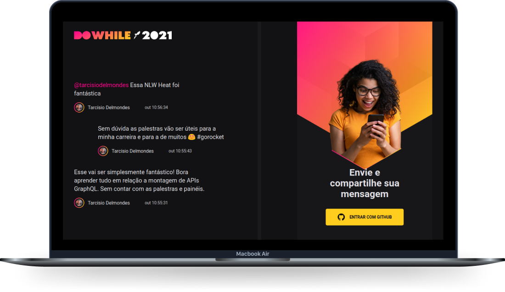

<h1 align="center">
  React - NLW Heat
</h1>

<a href="#funcionalidades">Funcionalidades</a>&nbsp;&nbsp;&nbsp;|&nbsp;&nbsp;&nbsp;
  <a href="#tecnologias">Tecnologias</a>&nbsp;&nbsp;&nbsp;|&nbsp;&nbsp;&nbsp;
  <a href="#projeto">Projeto</a>&nbsp;&nbsp;&nbsp;|&nbsp;&nbsp;&nbsp;
  <a href="#layout">Layout</a>&nbsp;&nbsp;&nbsp;|&nbsp;&nbsp;&nbsp;
  <a href="#licença">Licença</a>

 

  

 

  

## Funcionalidades

- [x] Mostra o horario que foi criado a mensagem.
- [x] Limite máximo de messages, 20.
- [x] Pode dar Scroll na tela para ver outras mensages.
- [x] Marcar pessoas com @username.
- [x] Mostra a mensagem de pessoas marcadas com um cor diferente.
- [x] Se o usuario for marcado, a mensagem fica em destaque para ele.
- [x] Mostra icone de loading se tiver acontecendo uma requisição.
- [x] Mostar popup ao enviar mensagem.
- [x] Scroll-bar com cor diferente do padrão.

## 🚀 Tecnologias

Esse projeto foi desenvolvido com as seguintes tecnologias:

- React
- TypeScript
- HTML
- Vite
- Socket.io
- Sass

## 💻 Projeto

React - NLW Heat é uma aplicação de troca de mensagens, que sera usada no DoWhile 2021.

## Layout

Você pode visualizar o layout do projeto através [desse link](<hhttps://www.figma.com/file/plAqgk7hH7gmauROr5EQLY/%5BNLW-Heat---Mission%3A-Impulse%5D-DoWhile2021-(Community)?node-id=0%3A1>). É necessário ter conta no [Figma](https://figma.com) para acessá-lo.

## Licença

Esse projeto está sob a licença MIT. Veja o arquivo [LICENSE](.github/LICENSE.md) para mais detalhes.

---

Feito com ♥ by Tarcisio Delmondes :wave: [Me siga no linkedin](https://www.linkedin.com/in/tarcisio-delmondes/)
